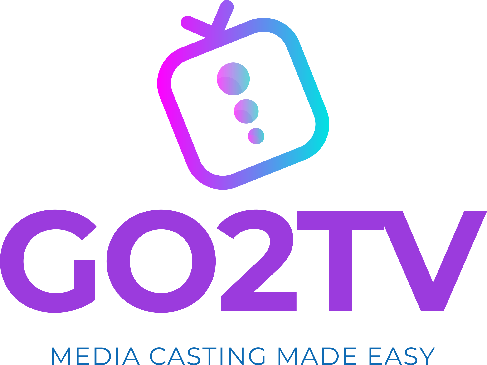

<br/>
<p align="center">

</a>
</p>
<br/>
<div align="center">
<p>

[](https://goreportcard.com/report/github.com/alexballas/Go2TV)
[](https://github.com/alexballas/Go2TV/releases/latest)
[](https://github.com/alexballas/go2tv/actions/workflows/go.yml)

[](https://github.com/alexballas/go2tv/actions/workflows/build-arm.yml)
[](https://github.com/alexballas/go2tv/actions/workflows/build-arm64.yml)
[](https://github.com/alexballas/go2tv/actions/workflows/build-android.yml)
[](https://github.com/alexballas/go2tv/actions/workflows/build-linux.yml)
[](https://github.com/alexballas/go2tv/actions/workflows/build-mac-intel.yml)
[](https://github.com/alexballas/go2tv/actions/workflows/build-mac.yml)
[](https://github.com/alexballas/go2tv/actions/workflows/build-windows.yml)
</p>
Cast media files to Smart TVs and Chromecast devices.
</div>

---

## What is Go2TV?

Go2TV lets you play video, audio, and image files on your Smart TV or Chromecast device directly from your computer or phone. It works with:

- **Smart TVs** - Samsung, LG, Sony, and others that support DLNA/UPnP
- **Chromecast** - Google Chromecast, Chromecast with Google TV, and compatible devices
- **Apps** - BubbleUPnP, GMediaRender, and other media receiver apps

No need to copy files to a USB drive or set up a media server. Just select your file, pick your device, and play.

---

## Installation

**Download the latest release** from the [releases page](https://github.com/alexballas/Go2TV/releases/latest).

- **Windows**: Download `go2tv_vX.Y.Z_windows_amd64.zip`, extract, and run `go2tv.exe`
- **macOS**: Download `go2tv_vX.Y.Z_macOS_amd64.zip` (Intel) or `go2tv_vX.Y.Z_macOS_arm64.zip` (Apple Silicon), extract, and run the app
- **Linux**: Download `go2tv_vX.Y.Z_linux_amd64.zip` (or appropriate arch), extract, and run `go2tv`
- **Android**: Download the APK (`go2tv_vX.Y.Z.apk`) or zip (`go2tv_vX.Y.Z_android.zip`)

Go2TV is a single executable with no installation required. Just download and run.

### Optional: FFmpeg for Transcoding

For maximum compatibility with all devices and file formats, install [FFmpeg](https://ffmpeg.org/download.html). Go2TV will automatically use it when needed.

- **Linux**: `sudo apt install ffmpeg` or equivalent for your distro
- **macOS**: `brew install ffmpeg`
- **Windows**: Download from [ffmpeg.org](https://ffmpeg.org/download.html) and add to PATH
- **Flatpak**: FFmpeg is bundled automatically

---

## Screenshots

**GUI Mode**


**CLI Mode**


---

## RTMP Streaming (Chromecast only)

Go2TV can act as an RTMP server, allowing you to stream from OBS or other software directly to your Chromecast. **This feature requires FFmpeg.**

1. Select a **Chromecast** device.
2. Check the **RTMP Server** box.
3. Click **Play** in Go2TV (the app will wait for the stream).
4. Use the provided URL in your streaming software (e.g., OBS Settings > Stream).
5. Start streaming in your software.

---

## CLI Usage

``` console
$ go2tv -h
Usage of go2tv:
  -l    List available devices (Smart TVs and Chromecasts).
  -s string
        Path to subtitles file (.srt or .vtt).
  -t string
        Device URL to cast to (from -l output).
  -tc
        Force transcoding with ffmpeg.
  -u string
        URL to media file (triggers CLI mode).
  -v string
        Path to video/audio file (triggers CLI mode).
  -version
        Print version.
```

**Examples**

``` console
# List available devices
go2tv -l

# Play a video on your TV
go2tv -v movie.mp4 -t http://192.168.1.100:8060/

# Play with subtitles
go2tv -v movie.mp4 -s movie.srt -t http://192.168.1.100:8060/

# Force transcoding for incompatible formats
go2tv -v video.avi -tc -t http://192.168.1.100:8060/

# Cast to Chromecast
go2tv -v movie.mp4 -t http://192.168.1.50:8009

# Stream from stdin
cat video.mp4 | go2tv -t http://192.168.1.50:8009

# Stream from command output
yt-dlp -o - "https://youtu.be/..." | go2tv -t http://192.168.1.50:8009

# Stream from stdin with transcoding
cat video.mkv | go2tv -tc -t http://192.168.1.50:8009

# Stream from command output with transcoding
yt-dlp -o - "https://youtu.be/..." | go2tv -tc -t http://192.168.1.50:8009
```

---

## Features

- **Auto-discovery** - Automatically finds Smart TVs and Chromecast devices on your network
- **Transcoding** - Converts incompatible video formats on-the-fly (requires FFmpeg)
- **Subtitles** - Supports external SRT/VTT files and embedded MKV subtitles
- **Seek support** - Jump to any position in the video
- **Loop and auto-play** - Loop a single file or auto-play the next file in folder
- **Gapless playback** - Supported for DLNA devices
- **RTMP Server** - Cast live streams from OBS directly to Chromecast (requires FFmpeg)
- **GUI and CLI** - Use the graphical interface or command line

## Companion Project: mcp-beam MCP Server (Powered by Go2TV)

[mcp-beam](https://go2tv.app/mcp-beam/) is a companion MCP server (stdio transport) built on top of Go2TV core packages.

Use it when you want MCP clients/agents to:

- Discover Chromecast and DLNA/UPnP devices on your LAN
- Cast local media files
- Cast remote media URLs
- Stop active playback sessions

If you want direct end-user control, use Go2TV GUI/CLI.  
If you want tool-driven casting from MCP-compatible workflows, use mcp-beam.

### Supported File Types (GUI)

mp4, avi, mkv, mpeg, mov, webm, m4v, mpv, mp3, flac, wav, jpg, jpeg, png

The CLI accepts any file type.

---

## Notes

**Firewall Configuration**

Go2TV uses ports 3339-3438 for device discovery. If you're behind a firewall, allow inbound UDP traffic on these ports.

**macOS Security**

If you see "cannot be opened because the developer cannot be verified":
1. Control-click the app, then choose Open from the menu
2. Click Open

If you see "go2tv is damaged and can't be opened":
- Run: `xattr -cr /path/to/go2tv.app`

---

## Building from Source

**Requirements**: Go 1.25

``` console
git clone https://github.com/alexballas/go2tv
cd go2tv
make build
```

**Using Docker**

Build the image:
``` console
docker build --force-rm -t go2tv .
```

Run the container (Linux with X11):
``` console
xhost +local:docker
docker run -it --network host -e DISPLAY=$DISPLAY -v /tmp/.X11-unix:/tmp/.X11-unix go2tv go2tv
```

---

## Author

Alexandros Ballas <alex@ballas.org>

## License

MIT
