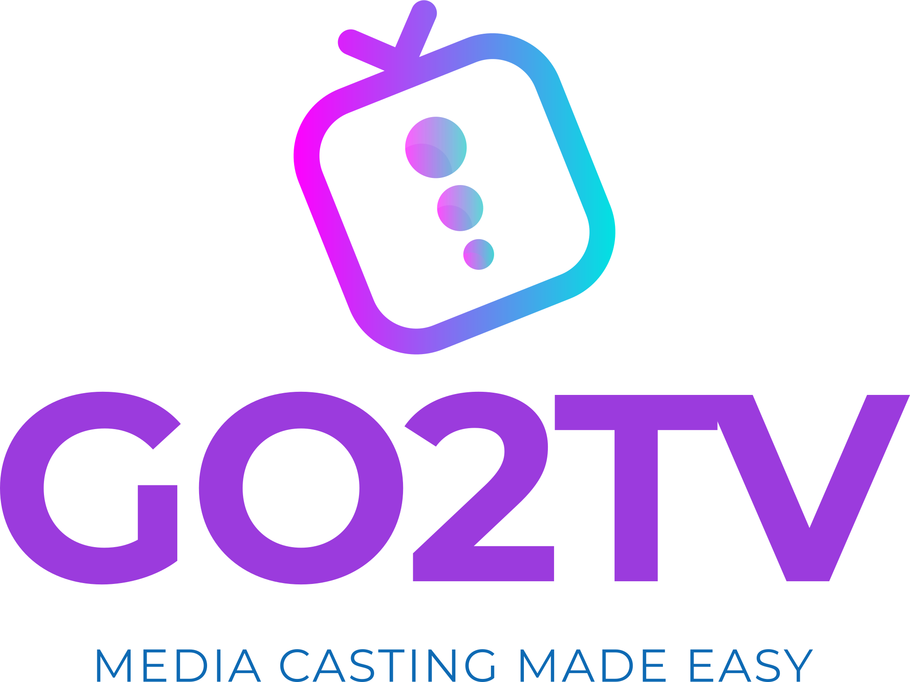
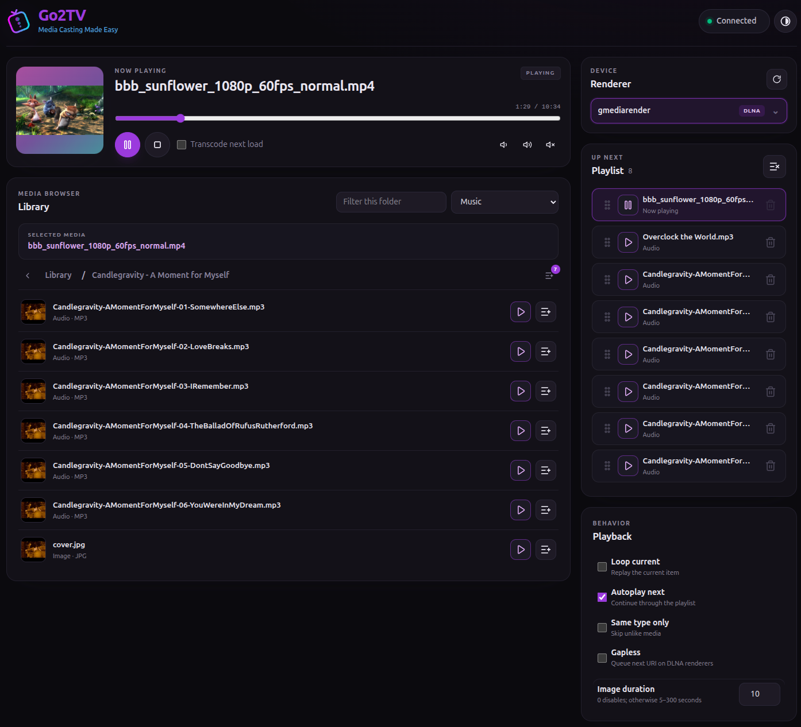

<br/>
<p align="center">

</a>
</p>
<br/>
<div align="center">
<p>

[](https://github.com/alexballas/Go2TV/releases/latest)
[](https://github.com/alexballas/go2tv/actions/workflows/go.yml)

[](https://github.com/alexballas/go2tv/actions/workflows/build-arm.yml)
[](https://github.com/alexballas/go2tv/actions/workflows/build-arm64.yml)
[](https://github.com/alexballas/go2tv/actions/workflows/build-android.yml)
[](https://github.com/alexballas/go2tv/actions/workflows/build-linux.yml)
[](https://github.com/alexballas/go2tv/actions/workflows/build-mac-intel.yml)
[](https://github.com/alexballas/go2tv/actions/workflows/build-mac.yml)
[](https://github.com/alexballas/go2tv/actions/workflows/build-windows.yml)
</p>
Cast media files to Smart TVs and Chromecast devices.
</div>

---

## What is Go2TV?

Go2TV lets you play video, audio, and image files on your Smart TV or Chromecast device directly from your computer or phone. It works with:

- **Smart TVs** - Samsung, LG, Sony, and others that support DLNA/UPnP
- **Chromecast** - Google Chromecast, Chromecast with Google TV, and compatible devices
- **Apps** - BubbleUPnP, GMediaRender, and other media receiver apps

No need to copy files to a USB drive or set up a media server. Just select your file, pick your device, and play.

---

## Installation

**macOS**: Install with Homebrew:

```bash
brew install --cask go2tv
```

Or **download the latest release** from the [releases page](https://github.com/alexballas/Go2TV/releases/latest).

- **Windows**: Download `go2tv_vX.Y.Z_windows_amd64.zip`, extract, and run `go2tv.exe`
- **macOS**: Download `go2tv_vX.Y.Z_macOS_amd64.zip` (Intel) or `go2tv_vX.Y.Z_macOS_arm64.zip` (Apple Silicon), extract, and run the app
- **Linux**: Download `go2tv_vX.Y.Z_linux_amd64.zip` (or appropriate arch), extract, and run `go2tv`
- **Android**: Download `go2tv_vX.Y.Z.apk` for the arm64 build with bundled FFmpeg transcoding

For release downloads, Go2TV is a single executable with no installation required. Just download and run.

### Optional: FFmpeg for Transcoding

For maximum compatibility with all devices and file formats, install [FFmpeg](https://ffmpeg.org/download.html). Go2TV will automatically use it when needed.
When transcoding is enabled, Go2TV probes available GPU H.264 encoders first and falls back to `libx264` if hardware encoding is unavailable or fails at startup.

- **Linux**: `sudo apt install ffmpeg` or equivalent for your distro
- **macOS**: `brew install ffmpeg`
- **Windows**: Download from [ffmpeg.org](https://ffmpeg.org/download.html) and add to PATH
- **Flatpak**: FFmpeg is bundled automatically
- **Android**: FFmpeg is bundled in the default APK. It is arm64-only and requires Android 9.0+.

---

## Screenshots

**GUI Mode**


**CLI Mode**


**Web UI (Server Mode)**

<picture>
  <source media="(prefers-color-scheme: dark)" srcset="assets/webui-dark.png">
  <source media="(prefers-color-scheme: light)" srcset="assets/webui-light.png">
  
</picture>

Enable **Autoplay next** and **Gapless** to queue the next playlist item with DLNA `SetNextAVTransportURI` on compatible renderers. Chromecast keeps ordinary autoplay.

---

## Playlist (GUI)

Go2TV GUI keeps the current selection in a **Playlist**, even for a single file.

- Selecting or dropping a single local file creates a 1-item playlist
- Selecting or dropping multiple files creates a multi-item playlist
- The **Playlist** window lets you add, remove, reorder, and select items
- Drag and drop on the main window replaces the current playlist
- Drag and drop on the Playlist window appends files when a playlist already exists
- **Next**, **Previous**, and **Auto-Play Next File** follow the playlist order
- **Auto-Play Next File** wraps to the start of the playlist when it reaches the end
- **Same File Types Only** is still respected for auto-play traversal

---

## RTMP Streaming (Chromecast only)

Go2TV can act as an RTMP server, allowing you to stream from OBS or other software directly to your Chromecast. **This feature requires FFmpeg.**

1. Select a **Chromecast** device.
2. Check the **RTMP Server** box.
3. Click **Play** in Go2TV (the app will wait for the stream).
4. Use the provided URL in your streaming software (e.g., OBS Settings > Stream).
5. Start streaming in your software.

---

## Cast Desktop (Experimental, Chromecast only)

Go2TV can cast your desktop as a live stream to Chromecast devices. **This feature is experimental and requires FFmpeg.**

1. Select a **Chromecast** device.
2. Check **Cast Desktop (experimental)**.
3. Click **Cast**.

Notes:
- Experimental: behavior/performance may vary by system.
- Chromecast only (not DLNA/UPnP TVs).
- Not supported on audio-only Chromecast devices.

---

## Web UI (Server Mode)

Go2TV can run headless as a small web server and expose a browser-based UI, so you can
browse your media and control casting from any device on your network including your
phone or tablet without the desktop GUI.

Server mode is enabled with `-server` and needs at least one `-media-root` (the directory
that Go2TV is allowed to browse and serve). By default it listens on `127.0.0.1:9666`.

**Start the server**

``` console
# Serve a single media directory on http://127.0.0.1:9666
go2tv -server -media-root /path/to/Media
```

Then open the printed URL (`http://127.0.0.1:9666/`) in your browser.

**Serve multiple media directories**

`-media-root` is repeatable. Pass it once per directory you want to expose. Each root
appears as a separate entry in the Web UI's media-root selector.

``` console
go2tv -server \
  -media-root /path/to/Movies \
  -media-root /path/to/Music \
  -media-root "/path/to/TV Shows"
```

Roots must be existing directories, and they cannot overlap or nest inside one another.

**Expose it on your LAN**

To reach the UI from another device, bind to a LAN address (or all interfaces) with
`-listen`. Any non-loopback listen address requires you to whitelist the browser origins
you'll connect from with `-allowed-origin` (repeatable, `scheme://host:port`):

``` console
go2tv -server \
  -listen 0.0.0.0:9666 \
  -allowed-origin http://192.168.1.20:9666 \
  -media-root /path/to/Media
```

> Server mode runs in trusted-LAN mode without TLS. Only expose it on networks you trust.

**Server-mode flags**

``` console
  -server
        Run Web server mode.
  -listen string
        Web server listen address. (default "127.0.0.1:9666")
  -media-root value
        Allowed media directory (repeatable; required with -server).
  -allowed-origin value
        Allowed Web origin, including scheme/host/port (repeatable).
  -debug
        Enable Web server protocol debug logs.
```

---

## CLI Usage

``` console
$ go2tv -h
Usage of go2tv:
  -l    List available devices (Smart TVs and Chromecasts).
  -s string
        Path to subtitles file (.srt or .vtt).
  -t string
        Device URL to cast to (from -l output).
  -tc
        Force transcoding with ffmpeg.
  -u string
        URL to media file (triggers CLI mode).
  -v string
        Path to video/audio file (triggers CLI mode).
  -version
        Print version.
```

**Examples**

``` console
# List available devices
go2tv -l

# Play a video on your TV
go2tv -v movie.mp4 -t http://192.168.1.100:8060/

# Play with subtitles
go2tv -v movie.mp4 -s movie.srt -t http://192.168.1.100:8060/

# Force transcoding for incompatible formats
go2tv -v video.avi -tc -t http://192.168.1.100:8060/

# Cast to Chromecast
go2tv -v movie.mp4 -t http://192.168.1.50:8009

# Stream from stdin
cat video.mp4 | go2tv -t http://192.168.1.50:8009

# Stream from command output
yt-dlp -o - "https://youtu.be/..." | go2tv -t http://192.168.1.50:8009

# Stream from stdin with transcoding
cat video.mkv | go2tv -tc -t http://192.168.1.50:8009

# Stream from command output with transcoding
yt-dlp -o - "https://youtu.be/..." | go2tv -tc -t http://192.168.1.50:8009
```

---

## Features

- **Auto-discovery** - Automatically finds Smart TVs and Chromecast devices on your network
- **Transcoding** - Converts incompatible video formats on-the-fly (requires FFmpeg)
- **Subtitles** - Supports external SRT/VTT files and embedded MKV subtitles
- **Seek support** - Jump to any position in the video
- **Playlist playback** - Single-file and multi-file playlists with add/remove/reorder/select support
- **Loop and auto-play** - Loop the current file or auto-play through the playlist
- **Gapless playback** - Supported for DLNA devices
- **RTMP Server** - Cast live streams from OBS directly to Chromecast (requires FFmpeg)
- **Cast Desktop (experimental)** - Cast desktop as live stream to Chromecast (requires FFmpeg)
- **Web UI (server mode)** - Browse media roots and control casting from any browser on your network
- **GUI and CLI** - Use the graphical interface or command line

### Supported File Types (GUI)

mp4, avi, mkv, mpeg, mov, webm, m4v, mpv, mp3, flac, wav, jpg, jpeg, png

The CLI accepts any file type.

---

## Companion Project: mcp-beam MCP Server (Powered by Go2TV)

[mcp-beam](https://go2tv.app/mcp-beam/) is a companion MCP server (stdio transport) built on top of Go2TV core packages.

Use it when you want MCP clients/agents to:

- Discover Chromecast and DLNA/UPnP devices on your LAN
- Cast local media files
- Cast remote media URLs
- Stop active playback sessions

If you want direct end-user control, use Go2TV GUI/CLI.  
If you want tool-driven casting from MCP-compatible workflows, use mcp-beam.

---

## Notes

**Chromecast receiver**

Go2TV uses a custom Chromecast receiver hosted at https://cast-receiver.go2tv.app/. It is not part of this open-source repository and is not currently published. Functionality matches the default receiver, with minor branding differences.

**Firewall Configuration**

If you're behind a firewall, allow inbound traffic from devices on your local network:

- `3339-3438/udp` for DLNA/UPnP device discovery
- `3500-4499/tcp` for the local HTTP media server used by DLNA and Chromecast playback

---

## Building from Source

**Requirements**: Go 1.26

``` console
git clone https://github.com/alexballas/go2tv
cd go2tv
make build
```

**AppImage build (Linux)**

``` console
make appimage
```

`v2.1` style build. No bundled `ffmpeg`/`ffprobe`.

**AppImage build (with ffmpeg, Linux)**

``` console
make appimage-ffmpeg
```

- `APPIMAGE_FFMPEG_MODE=auto` (default): use host `ffmpeg`/`ffprobe` if static; else download prebuilt bundle
- `APPIMAGE_FFMPEG_MODE=system`: require host `ffmpeg`/`ffprobe`
- `APPIMAGE_FFMPEG_MODE=download`: always download prebuilt bundle
- `APPIMAGE_FFMPEG_MODE=none`: build AppImage without ffmpeg binaries
- Optional explicit paths: `APPIMAGE_FFMPEG_BIN=/path/ffmpeg APPIMAGE_FFPROBE_BIN=/path/ffprobe`

**Android builds**

``` console
make android
```

`make android` builds the arm64 APK and bundles Android `ffmpeg`/`ffprobe` executables as native libraries. Set `ANDROID_NDK_HOME` and `ANDROID_HOME`.

**Using Docker**

Build the image:
``` console
docker build --force-rm -t go2tv .
```

Run the container (Linux with X11):
``` console
xhost +local:docker
docker run -it --network host -e DISPLAY=$DISPLAY -v /tmp/.X11-unix:/tmp/.X11-unix go2tv go2tv
```

---

## Author

Alexandros Ballas <alex@ballas.org>

## License

MIT

Artifacts that bundle FFmpeg inherit the bundled FFmpeg build's license obligations. The Android FFmpeg APK uses an Android NDK-built LGPL FFmpeg package by default; AppImages built with the default bundled FFmpeg use GPL builds.
